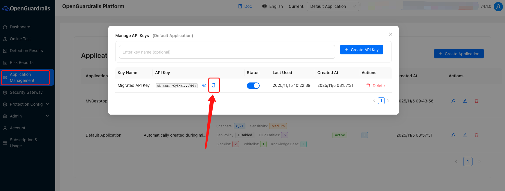
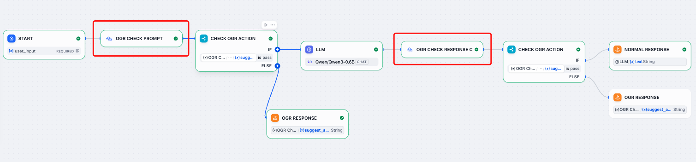

# OpenGuardrails

**Author:** openguardrails  
**Version:** 0.0.4
**Type:** tool  

## Description  

### Overview 

The **OpenGuardrails plugin** provides AI moderation and security tools for Dify applications.  
It is **open-source, free, context-aware, and designed for AI application developers**.  

OpenGuardrails focuses on:  
- **Both guardrails LLM and platform are open sourced** (Apache 2.0)  
- **Prompt Injection Attack Detection** (based on **OWASP TOP 10 LLM Applications**)  
- **Content Safety & Compliance** (based on **Rich risk categories**) 
- **Sensitive Data Leakage Prevention** PII, Business Secrets
- **Contextual Semantic Understanding** for precise detection  
- **Runtime Protection** with dual deployment modes:  
  - **API Detection Mode** – flexible integration and precise control  
  - **Security Gateway Mode** – WAF-like transparent proxy, zero code change   

### Core Protection Capabilities

- **Prompt Attack Detection**  
  Jailbreaks, prompt injection, role-playing, rule bypass  

- **Content Safety Detection**  
  Context-aware detection for content safety  

- **Sensitive Data Leakage Prevention**
  PII, Business Secrets。

**19 Risk Categories**:  
- **High Risk**: Sensitive Politics, Violance Crime and more  
- **Medium Risk**: Hate, Commercial Misconduct and more 
- **Low Risk**: Harassment and more

### Open Source Advantages 

- Apache 2.0 License  
- Free to use  
- Data never leaves your environment (local processing)  
- Fully supports **private deployment**  

**Open Source Repositories**: 
- Code Repository: [github.com/openguardrails/dify-plugin-openguardrails](https://github.com/openguardrails/dify-plugin-openguardrails)  
- Model Repository: [huggingface.co/openguardrails](https://huggingface.co/openguardrails)  

### Included Tools

#### 1. check_prompt  
OpenGuardrails - Check Prompt  

- Detect user input for prompt attacks, jailbreaks, malicious operations and content safety issues based on **OWASP TOP 10 LLM Applications** and **Content safety standards**  

**Input**: `prompt` (user input to the model)  

**Output**:  
```yaml
id:
  type: string
  description: "Unique identifier for the guardrails check"
overall_risk_level:
  type: string
  description: "Overall risk level: no_risk, low_risk, medium_risk, high_risk"
suggest_action:
  type: string
  description: "Suggested action: pass, reject, replace"
suggest_answer:
  type: string
  description: "Suggested alternative answer if action is replace, empty string if not applicable"
categories:
  type: string
  description: "Risk categories, separated by commas"
score:
  type: number
  description: "Detection probability score (0.0-1.0)"
```  

#### 2. check_response_ctx  
OpenGuardrails - Check Response Contextual  

- Detect AI response data leakage and content safety based on **context understanding**, including harmful content and compliance risks based on **Content safety standards**  

**Input**: `prompt` (user input) + `response` (AI output)  
**Output**: 
```yaml
id:
  type: string
  description: "Unique identifier for the guardrails check"
overall_risk_level:
  type: string
  description: "Overall risk level: no_risk, low_risk, medium_risk, high_risk"
suggest_action:
  type: string
  description: "Suggested action: pass, reject, replace"
suggest_answer:
  type: string
  description: "Suggested alternative answer if action is replace, empty string if not applicable"
categories:
  type: string
  description: "Risk categories, separated by commas"
score:
  type: number
  description: "Detection probability score (0.0-1.0)"
```  

## Configure 

To use OpenGuardrails, you need an **API Key**:  

1. Register at the OpenGuardrails Platform: [https://OpenGuardrails.com/platform/](https://OpenGuardrails.com/platform/)  
2. Log in and go to **Application Management** → Get your API Key for free
  
3. Add the API Key to your Dify plugin configuration  

## Example Usage

Use OpenGuardrails’ **OGR Check Prompt** and **OGR Check Response Contextual** tools to protect the input and output of large language models.  

  

## Issue Feedback  

For more details, workflows, and best practices, please visit:  
- [OpenGuardrails Official Website](https://OpenGuardrails.com)  
- [Code Repository](https://github.com/openguardrails/dify-plugin-openguardrails)  
- [Model Repository](https://huggingface.co/openguardrails)  

If you encounter issues, feel free to open an **Issue** on GitHub.  
For business cooperation, please contact **thomas@OpenGuardrails.com**  

