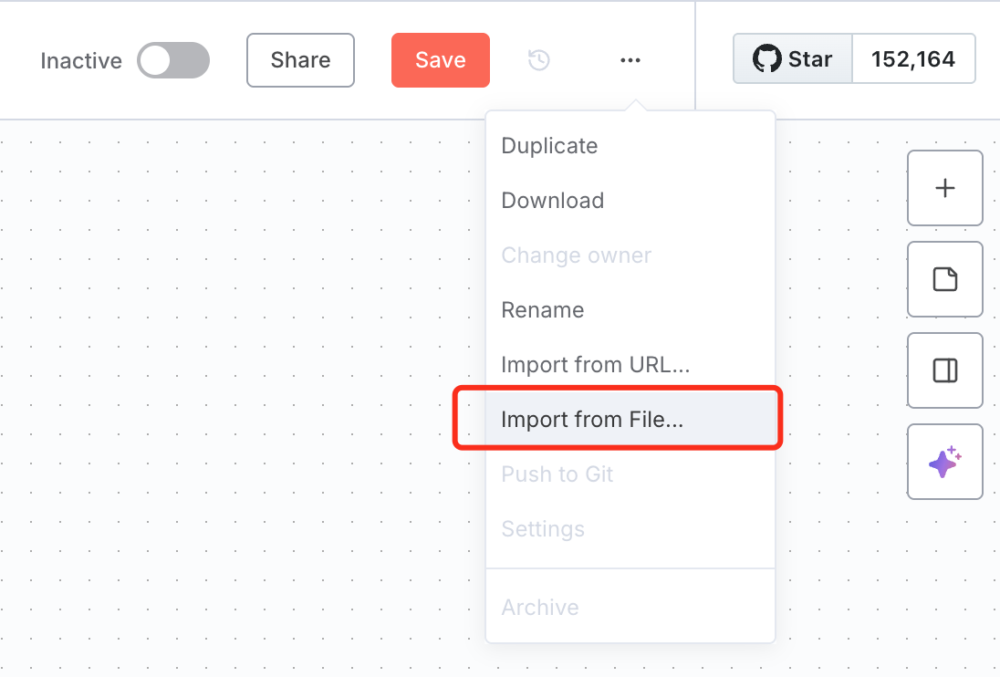

# OpenGuardrails n8n Integration - HTTP Request Node

This guide shows how to integrate OpenGuardrails with n8n using the built-in HTTP Request node.

## Prerequisites

- n8n instance (self-hosted or cloud)
- OpenGuardrails API key (get it from https://api.openguardrails.com)
- Basic understanding of n8n workflows

## Quick Start

### Step 1: Set up OpenGuardrails Credentials

1. In **n8n**, go to **Credentials** → **New**.
2. Search for **Bearer Auth**.
3. Configure the following:
   * **Bearer Token**: `sk-xxai-YOUR-API-KEY-HERE`
You can register and log in at [https://openguardraisl.com/platform/](https://openguardraisl.com/platform/) to get a free Bearer token.

### Step 2: Import Workflow

Import one of the workflow JSON files:
- `basic-content-check.json` - Simple content safety check
- `chatbot-with-moderation.json` - AI chatbot with input/output moderation



### Step 3: Configure and Test

1. Open the imported workflow
2. Click on the HTTP Request node
3. Select your OpenGuardrails API credentials
4. Test the workflow

## Workflows Included

### 1. Basic Content Check (`basic-content-check.json`)

**Use Case**: Check if user input is safe before processing

**Flow**:
```
Webhook/Manual Trigger → HTTP Request (OpenGuardrails) → IF Node → Response
```

**Features**:
- Input content safety check
- Returns pass/reject/replace action
- Gets safe response if content is risky

### 2. Chatbot with Moderation (`chatbot-with-moderation.json`)

**Use Case**: AI chatbot with comprehensive input/output protection

**Flow**:
```
User Input → Input Check (OpenGuardrails) → IF Pass → LLM Call → Output Check → Response
```

**Features**:
- Input moderation (blocks malicious prompts)
- Output moderation (ensures safe AI responses)
- Automatic safe response substitution
- Conversation history support

## API Configuration Details

### HTTP Request Node Settings

**Basic Settings**:
- **Method**: `POST`
- **URL**: `https://api.openguardrails.com/v1/guardrails`
- **Authentication**: `Header Auth` (OpenGuardrails API credentials)

**Headers**:
```json
{
  "Content-Type": "application/json"
}
```

**Body (JSON)**:
```json
{
  "model": "OpenGuardrails-Text",
  "messages": [
    {
      "role": "user",
      "content": "{{ $json.content }}"
    }
  ]
}
```

### Response Structure

OpenGuardrails returns:
```json
{
  "id": "req-xxx",
  "model": "OpenGuardrails-Text",
  "choices": [{
    "message": {
      "role": "assistant",
      "content": "{\"action\":\"pass\",\"risk_level\":\"none\",\"categories\":[]}"
    }
  }]
}
```

**Parsed Content Fields**:
- `action`: `pass` | `reject` | `replace`
- `risk_level`: `none` | `low` | `medium` | `high`
- `categories`: Array of detected risk categories
- `suggest_answer`: Safe response (when action is `replace`)

## Common Use Cases

### Use Case 1: Content Moderation for User Comments

```javascript
// Check user comment before posting
Input: {{ $json.comment }}
Action on reject: Return error "Content violates community guidelines"
Action on replace: Use suggest_answer as filtered version
```

### Use Case 2: AI Chatbot Protection

```javascript
// Step 1: Check user input for prompt attacks
Input Check → If pass → Send to LLM

// Step 2: Check LLM output for unsafe content
LLM Response → Output Check → If pass → Return to user
```

### Use Case 3: Document Processing Safety

```javascript
// Check documents for sensitive data before processing
Document Text → Data Security Check → If pass → Continue processing
If reject → Flag for manual review
```

### Use Case 4: Email Campaign Safety

```javascript
// Check email content before sending
Email Content → Compliance Check → If pass → Send email
If reject → Alert marketing team
```

## Advanced Configuration

### Multi-turn Conversation Support

For chatbot scenarios with conversation history:

```json
{
  "model": "OpenGuardrails-Text",
  "messages": [
    {
      "role": "user",
      "content": "{{ $json.history }}"
    },
    {
      "role": "user",
      "content": "{{ $json.currentMessage }}"
    }
  ]
}
```

### Custom User Identification

Track specific users for ban policy enforcement:

```json
{
  "model": "OpenGuardrails-Text",
  "messages": [...],
  "xxai_app_user_id": "{{ $json.userId }}"
}
```

### Selective Detection

Enable only specific detection types:

```json
{
  "model": "OpenGuardrails-Text",
  "messages": [...]
}
```

## Parsing the Response in Code Node

After the HTTP Request node, you need to parse the OpenGuardrails response. Here's the correct way to access the data:

```javascript
// In the Code node after HTTP Request
const items = $input.all();
const data = items[0].json;

// Parse the OpenGuardrails response
const response = JSON.parse(data.choices[0].message.content);

// Return structured data
return {
  action: response.action,
  risk_level: response.risk_level,
  categories: response.categories || [],
  suggest_answer: response.suggest_answer || null,
  hit_keywords: response.hit_keywords || []
};
```

**Important Notes**:
- Use `$input.all()[0].json` to access the HTTP Request response
- The actual detection result is in `choices[0].message.content` as a JSON string
- Parse this JSON string to get the structured result
- The workflows included already have this correct parsing code

## Handling Different Actions

### Action: PASS

Content is safe, continue normal processing:

```javascript
// IF Node condition
{{ $json.action === 'pass' }}
// Then: Continue to next step
```

### Action: REJECT

Content is unsafe, block the request:

```javascript
// IF Node condition
{{ $json.action === 'reject' }}
// Then: Return error response
{
  "error": "Content blocked due to safety concerns",
  "categories": "{{ $json.categories }}"
}
```

### Action: REPLACE

Content is unsafe, use safe alternative:

```javascript
// IF Node condition
{{ $json.action === 'replace' }}
// Then: Use suggest_answer
{
  "response": "{{ $json.suggest_answer }}",
  "note": "Response was moderated"
}
```

## Error Handling

### Common Errors

**401 Unauthorized**:
- Check your API key is correct
- Ensure "Bearer " prefix is included
- Verify API key is active in dashboard

**429 Rate Limited**:
- You've exceeded your rate limit
- Wait and retry or upgrade your plan

**500 Server Error**:
- Temporary server issue
- Implement retry logic with exponential backoff

### Retry Logic Example

Add an Error Trigger node:
```javascript
// Retry configuration
Max Retries: 3
Retry Interval: 1000ms (exponential)
Error Codes: 429, 500, 502, 503
```

## Performance Tips

1. **Batch Processing**: Use the batch workflow for multiple items
2. **Caching**: Cache results for identical content (use Code node)
3. **Selective Detection**: Only enable checks you need
4. **Async Processing**: Use n8n's queue mode for high volume

## Monitoring and Logging

Add a logging step after OpenGuardrails check:

```javascript
// Code node to log results
const result = $input.item.json;
console.log({
  timestamp: new Date(),
  action: result.action,
  risk_level: result.risk_level,
  categories: result.categories
});
```

## Troubleshooting

### Issue: "Cannot read properties of undefined (reading '0')"

**Cause**: Incorrect data access in Code node

**Solution**: Use the correct way to access HTTP Request response:

```javascript
// CORRECT ✅
const items = $input.all();
const data = items[0].json;
const response = JSON.parse(data.choices[0].message.content);

// INCORRECT ❌
const response = JSON.parse($input.item.json.choices[0].message.content);
```

### Issue: Response parsing fails

**Solution**: The response content is a JSON string, parse it:

```javascript
// Code node after HTTP Request
const items = $input.all();
const data = items[0].json;
const response = JSON.parse(data.choices[0].message.content);

return {
  action: response.action,
  risk_level: response.risk_level,
  categories: response.categories,
  suggest_answer: response.suggest_answer
};
```

### Issue: Workflow is slow

**Potential causes**:
- Network latency to API
- Processing large content
- Not using batch processing

**Solutions**:
- Use n8n's queue mode
- Implement batch processing workflow
- Cache repeated checks

## Next Steps

- Explore the custom OpenGuardrails node for better user experience
- Set up monitoring and alerts for blocked content
- Integrate with your existing n8n workflows

## Support

- OpenGuardrails Documentation: https://www.openguardrails.com/docs
- n8n Community: https://community.n8n.io
- Email: thomas@openguardrails.com

## License

These examples are provided under Apache 2.0 license.
